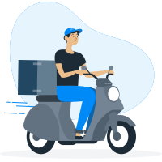

## Icons

## File

> Import IconsModule into your custom module

  ```typescript
  import { IconsModule } from '@atoms/icons/icons.module';

@NgModule({
    imports: [
        IconsModule,
    ]
})

export class YourModule {
}
  ```

## How to add new icons

> #### 1.Add icon into directory

  ````
  src/assets/icons/
  ````

> #### 2.Update constants files

  ```
   src/app/core/atoms/icons/constants/icons-svg.ts
  ```

   ````typescript
   const ICONS_SVG = [
    {...},
    {name: 'ICON_NAME', path: `${path}ICON_NAME.svg`},
];
   ````

> #### 3.Update README.md`

Update readme with the new icon name

  ```
   core/atoms/icons/README.md
  ```

### Usage

> HTML

  ```html  
    <app-icon iconSvgWidth="16" iconSvgName="world-marker-colored"></app-icon>
    <app-icon iconSvgWidth="16" iconSvgName="setup-preferences"></app-icon>
    <app-icon iconSvgWidth="56" iconSvgName="setup-preferences"></app-icon>
    <app-icon iconSvgWidth="14" iconSvgName="card-oh-mini"></app-icon>
    <app-icon iconFontSize="16" iconFontName="card-oh-mini"></app-icon>
    <app-icon iconFontSize="24" iconFontName="card-oh-mini"></app-icon>
    <app-icon iconFontSize="32" iconFontName="card-oh-mini"></app-icon>
  ```     

### Icons


### Icons List

| Icon | Name |   |Icon | Name |
|------|------|---|-----|------|
|             | ampm                  | |                    | mifarma             |
|           | avatar                | |                       | moto                |
|             | book                  | |                 | navigation          |
|         | calendar              | |                     | stores              |
|    | configuration         | |                      | truck               |
|        | inkafarma             | |                     | search              |
|        | main-logo             | |                 | datepicker          |
|  | ellipse-success       | |           | ellipse-disabled    |
|           | loader                | |           |               |

<br/>

### Illustrations List
|Illustration | Name |   | Illustration | Name |
|-------------|------|---|--------------|------|
|      | assigned-orders       | |             | lost-connection       |
|       | call-attention        | |           | lost-connection-1     |
|        | communication         | |                    | on-route              |
|       | empty-orders-1        | |              | order-canceled        |
|         | empty-orders          | |               | order-updated         |
|                  | gps                   | |                     | payment               |
|                | login                 | |                | send-message          |
|          | look-orders           | |                        | sent                  |
|        | looking-files         | |          | under-construction    |
|         | search-store          | |                        | logo                  |


